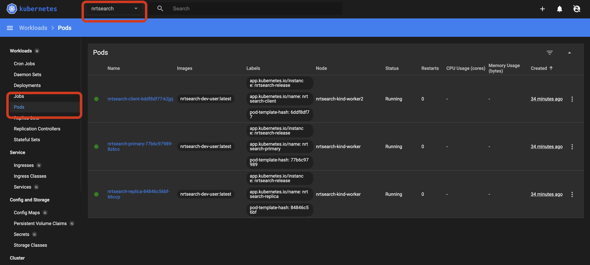

Helm Chart
=============

Introduction
------------

Nrtsearch can be packaged as Helm Charts and deployed in a local or remote Kubernetes cluster. This document describes how to deploy Nrtsearch using the provided utils in a new local or in an existing Kubernetes cluster.

Firstly, a quick introduction to a few technologies that are mentioned throughout this doc:

1. Helm
^^^^^^^^
`Helm <https://helm.sh/>`_ is widely known as the package manager of Kuberentes.
Helm simplifies the process of writing and maintaining Kubernetes YAML manifests for all the required Kubernetes objects by creating a single package (chart).
Helm deploys `charts <https://helm.sh/docs/topics/charts/>`_ which can be thought of as packaged applications.Helm also keeps a release history of all deployed charts, so you can go back to a previous release if something went wrong.

2. Kubernetes Cluster
^^^^^^^^^^^^^^^^^^^^^
A `Kubernetes <https://kubernetes.io/docs/concepts/overview/>`_ cluster is a set of nodes for running containerized applications.
A cluster contains at least a control plane for maintaining the desired state of the cluster and one or more worker nodes for running the applications and workloads.

`Kind <https://kind.sigs.k8s.io/>`_, minikube are amongst the most popular options for setting up and running Kuberentes cluster locally. Later in this document we will make use of local ``Kind`` cluster to deploy Nrtsearch.

3. kubectl
^^^^^^^^^^
Kubernetes provides a command line tool `kubectl <https://kubernetes.io/docs/reference/kubectl/>`_ for communicating with a Kubernetes cluster's control plane, using the Kubernetes API.

4. Kubernetes Dashboard
^^^^^^^^^^^^^^^^^^^^^^^
`Kubernetes Dashboard <https://kubernetes.io/docs/tasks/access-application-cluster/web-ui-dashboard/>`_ is a web-based Kubernetes user interface which can be used to deploy containerized applications to a Kubernetes cluster, troubleshoot containerized application, and manage the cluster resources.

Explore Nrtsearch in local Kubernetes Cluster
---------------------------------------------

This section explains how you can quickly spin up a new Nrtsearch instance along with a new local `kind`_ kubernetes cluster using the provided utility scripts, it will:
    * `Bring up a local kind Kubernetes cluster`_ and setup Kubernetes Dashboard for easy access
    * `Deploy Nrtsearch Helm chart in the new local kind cluster`_
    * `Ingest and retrieve test data with Nrtsearch`_
    * `Cleanup Nrtsearch Helm release and remove local kind cluster`_
..

    Note: This section assumes that `Docker <https://www.docker.com/>`_, kubectl_ and kind_ are installed in your local machine.
..

    Nrtsearch helm charts can also be deployed as it is onto an existing Kubernetes cluster to bring up a working instance of Nrtsearch.
    Directly head over to `Deploy Nrtsearch Helm charts in existing Kubernetes cluster`_ section if you already have an existing Kubernetes cluster and are comfortable deploying the charts on your own.

Bring up a local kind Kubernetes Cluster
^^^^^^^^^^^^^^^^^^^^^^^^^^^^^^^^^^^^^^^^

First, let's spin up a new `kind`_ cluster locally. Change directory to the Nrtsearch project's root and execute the following script:

.. code-block::

    $ ./chart/files/utils/setup_kind_kube_cluster.sh

This script will:
    1. Build the Nrtsearch's docker image "nrtsearch-dev-user:latest"

    2. Setup a 3 node `kind`_ kubernetes cluster (named as "nrtsearch-kind")

    3. Setup Kubernetes Dashboard

The Kubernetes dashboard can be accessed using `this link <http://localhost:43101/api/v1/namespaces/kubernetes-dashboard/services/https:kubernetes-dashboard:/proxy/>`_. A guest login account has been created for the dashboard access.

    Note 1: The script may need to be assigned execute permissions before executing it
..

    Note 2: Upon the first access of dashboard, a login prompt will be presented. Click on "Skip" button to login to the dashboard.
..

    Note 3: if the script is executed on a remote machine (other than your local) then the above dashboard link will not work as it points to localhost. The following command can be executed in a separate terminal to enable connectivity and access dashboard on localhost:

.. code-block::

    $ ssh -C -N -L 0.0.0.0:43101:127.0.0.1:43101 <user_name>@<remote_host_ip>

At this point, the kind kubernetes cluster is ready. Both kubectl and Kubernetes Dashboard can be used to interact with the cluster.

Deploy Nrtsearch Helm chart in the new local kind cluster
^^^^^^^^^^^^^^^^^^^^^^^^^^^^^^^^^^^^^^^^^^^^^^^^^^^^^

From the Nrtsearch project's root, execute the following script:

.. code-block::

    $ ./chart/files/utils/helm_install_nrtsearch_kube.sh

This script will:
    1. Setup internally a Helm docker container to execute helm commands
    2. Create a new namespace named "nrtsearch" in the "nrtsearch-kind" kubernetes cluster
    3. Deploy Nrtsearch Helm charts in the "nrtsearch" namespace

That's it! we now have the Nrtsearch application up and running in our local kubernetes cluster.

Nrtsearch will have the following 3 pods up and running:
    * nrtsearch-primary-<hash>
    * nrtsearch-replica-<hash>
    * nrtsearch-client-<hash>

Once you login to `Kubernetes Dashboard <http://localhost:43101/api/v1/namespaces/kubernetes-dashboard/services/https:kubernetes-dashboard:/proxy/>`_ using the skip button.
Click on dropdown box (highlighed in the image below) in the top to select "nrtsearch" namespace and from the left sidebar under Workflow, click "pods" to access the nrtsearch pods.

For listing pods via kubectl, executing the following:

.. code-block::

    $ kubectl get pods --namespace nrtsearch

Ingest and retrieve test data with Nrtsearch
^^^^^^^^^^^^^^^^^^^^^^^^^^^^^^^^^^^^^^^^^^^^
Nrtsearch instance is now ready to read and write data. "nrtsearch-client-<hash>" pod already contains test data which can be used for a quick test.
Also, both nrtsearch primary and replica instances have a test index named "testIdx" created and started.
All that is left to do is to ingest "testIdx" compatible document and retrieve data back.

First, Login to "nrtsearch-client-<hash>" pod using kubernetes dashboard or kubectl, use the following command to login via kubectl:

.. code-block::

    $ kubectl exec -it nrtsearch-client-<hash> -c nrtsearch-client-main --namespace nrtsearch -- /bin/bash

Next, Add the docs to the test index "testIdx", execute the following command from within the "nrtsearch-client-<hash>" pod:

.. code-block::

    $ ./build/install/nrtsearch/bin/lucene-client -h nrtsearch-primary-svc.nrtsearch.svc.cluster.local -p 8000 addDocuments -i testIdx -f configs/docs.csv -t csv

Note that we are adding the documents via "nrtsearch-primary".

Finally, Let's retrieve the added documents now using "nrtsearch-replica", execute the following command from within the "nrtsearch-client-<hash>" pod:

.. code-block::

    $ ./build/install/nrtsearch/bin/lucene-client -h nrtsearch-replica-svc.nrtsearch.svc.cluster.local -p 8002 search -f configs/search.json

Cleanup Nrtsearch Helm release and remove local kind cluster
^^^^^^^^^^^^^^^^^^^^^^^^^^^^^^^^^^^^^^^^^^^^^^^^^^^^^^^^^^^^

Execute the following script from your local to uninstall the nrtsearch helm release and remove the kind cluster:

.. code-block::

    $ ./chart/files/utils/teardown_kind_kube_cluster.sh

Deploy Nrtsearch Helm charts in existing Kubernetes cluster
-----------------------------------------------------------

`Explore Nrtsearch in local Kubernetes Cluster`_ section described a quick inbuilt way to spin up an nrtsearch instance along with a new `kind`_ kuberenetes cluster in your local machine.
This section describes how you can deploy Nrtsearch helm charts in your existing Kubernetes clusters and it assumes that `kubectl`_ , `helm`_ are installed in your local machine.

To deploy Nrtsearch helm charts in your existing cluster the following helm command can be executed:

.. code-block::

    # for freshly installing nrtsearch
    $ helm install --create-namespace -n nrtsearch nrtsearch-release --values chart/values.yaml chart/

    # Execute the following to update the release after making changes to the charts
    $ helm upgrade --install --create-namespace -n nrtsearch nrtsearch-release --values chart/values.yaml chart/

This will create a new namespace named "nrtsearch" and will install the helm charts in the same.
By default, three pods will be created and running, namely nrtsearch-primary, nrtsearch-replica and nrtsearch-client.
Update the "values.yaml" to alter the default values assigned.
