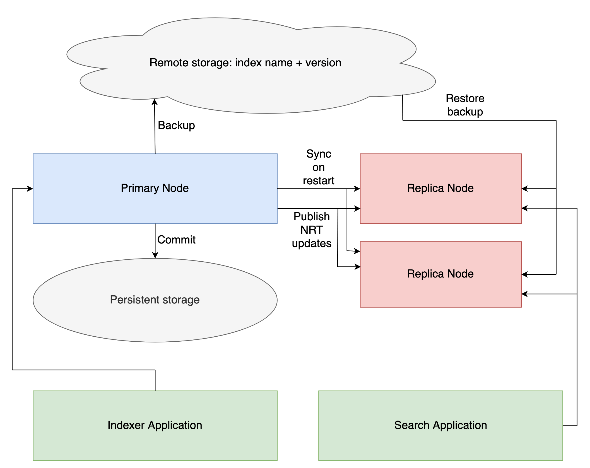

Introduction
==========================

Features
-----------------------------

* Relies on Lucene's `near-real-time segment replication <http://blog.mikemccandless.com/2017/09/lucenes-near-real-time-segment-index.html>`_ for data replication. This means, a dedicated primary/writer node takes care of indexing operations and expensive operations like `segment merges <http://blog.mikemccandless.com/2011/02/visualizing-lucenes-segment-merges.html>`_. This allows the replicas' system resources to be dedicated entirely for search queries. This behavior is in contrast to the document replication approach taken by some other popular search engines based on lucene like elasticsearch where every node is a writer and a reader.
* `Supports concurrent query execution <http://blog.mikemccandless.com/2019/10/concurrent-query-execution-in-apache.html>`_. This is another feature missing from popular search engines based on lucene like elasticsearch.
* Can be deployed as a "stateless microservice". Indexes are backed up in s3. Clients can choose to commit data outside of this system once their backup is complete. Upon restarts e.g. if you bring up a new container clients can choose to bootstrap indexes from their previous backed up state. Ability to deploy in a stateless manner allows for easy scalability using container tools like kubernetes, mesos etc.
* Provides gRPC streaming APIs for indexing and searching. Also supports REST APIs.

Design
---------------------------

The design goals are mostly similar to the ones mentioned in the `Lucene Server <https://github.com/mikemccand/luceneserver#design>`_ project. This project uses ideas and code from luceneserver and builds on them.

A single node can index a *stream* of documents, run near-real-time searches via a parsed query string, including "scrolled" searches, sorting, index-time sorting, etc.

Fields must first be registered with the *registerFields* command, where you express whether you will search, sort etc., and then documents can be indexed with those fields.

There is no transaction log, so you must call *commit* yourself periodically to make recent changes durable on disk. This means that if a node crashes, all indexed documents since the last commit are lost.

Indexing a stream of documents
---------------------------

NrtSearch supports client side gRPC streaming for its *addDocuments* endpoint. This means that the server API accepts a stream of documents . The client can choose to stream the documents however it wishes.
The example nrtSearch client implemented here reads a CSV file and streams documents from it over to the server. The server can index chunks of documents the size of which is configurable as the client continues to send more documents over its stream. gRPC enables this with minimal application code and yields higher performance compared to JSON.

Near-real-time-replication
---------------------------

This requirement is one of the primary reasons to create this project. `near-real-time-replication <https://issues.apache.org/jira/browse/LUCENE-5438>`_ seems a good alternative to document based replication when it comes to costs associated with maintaining large clusters. Scaling document based clusters up/down in a timely manner could be slower due to data migration between nodes apart from paying the cost for reindexing on all nodes.

Below is a depiction of how the system works in regards to Near-real-time (NRT) replication and durability.

* Primary node comes up with either no index or reads segments from disk or can restore an index from remote storage if the `restore` option is specified by the client on the `startIndex` command. This node will accept `indexing` requests from clients. It will also periodically  `publishNrtUpdate` to replicas giving them a chance to catch up with the latest primary indexing changes.
* Replica nodes are also started using the `startIndex` command. They will sync with the current primary and update their indexes using Lucene's NRT APIs. They can also restore the index from remote storage and then receive the updates since the last backup. These nodes will serve client's `search` queries.
* Each time client invokes `commit` on primary, it will save its current index state and related metadata e.g. schemas, settings to the disk. Clients should use the ack from this endpoint to commit the data in their channel e.g. kafka.
* Client can invoke `backupIndex` on the primary to backup the index to remote storage.
* If a replica crashes, a new one can be brought up and will re-sync with the current primary (optionally restoring the index from remote storage first). It will register itself with the primary once it's brought up.
* If a primary crashes, a new one can be brought up with the `restore` option on `startIndex` command to regain previous stored state in the cloud, but since primaries don't serve search requests they can also use network attached storage e.g. Amazon EBS to persist data across restarts. The replicas will then re-sync their indexes with the primary.

Build Server and Client
---------------------------

In the home directory, one can build nrtSearch locally like this:

.. code-block::

  ./gradlew clean installDist test

Note: This code has been tested on *Java14*.

Run gRPC Server
---------------------------

The server can be run locally like this:

.. code-block::

  ./build/install/nrtsearch/bin/lucene-server

Run REST Server
---------------------------

Use the appropriate binary for your platform e.g. for Mac OS X:

.. code-block::

  ./build/install/nrtsearch/bin/http_wrapper-darwin-amd64 <gRPC_PORT> <REST_PORT>